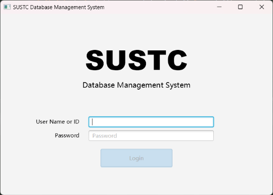
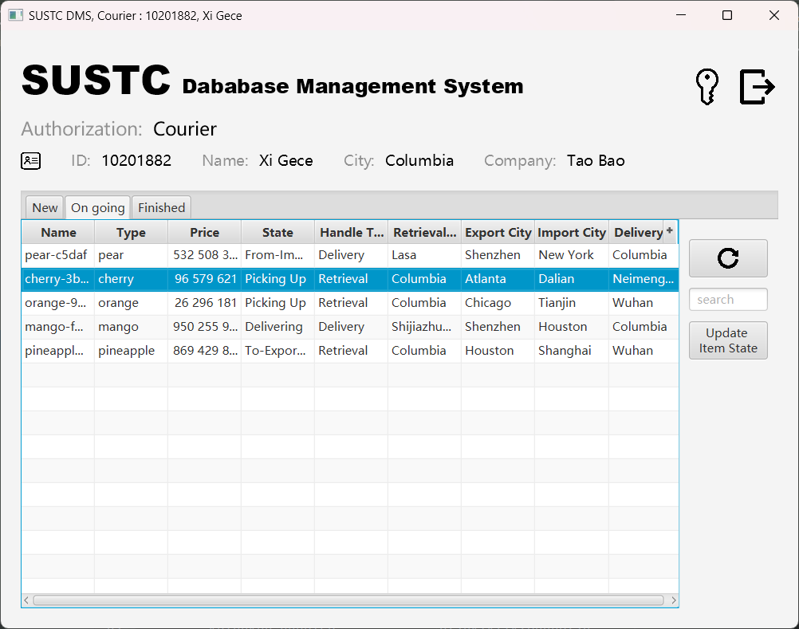
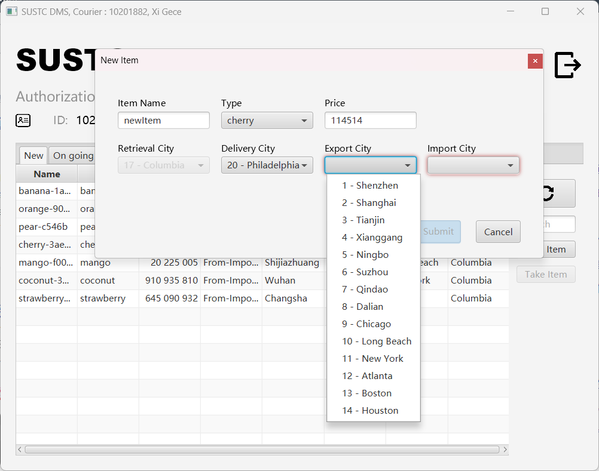
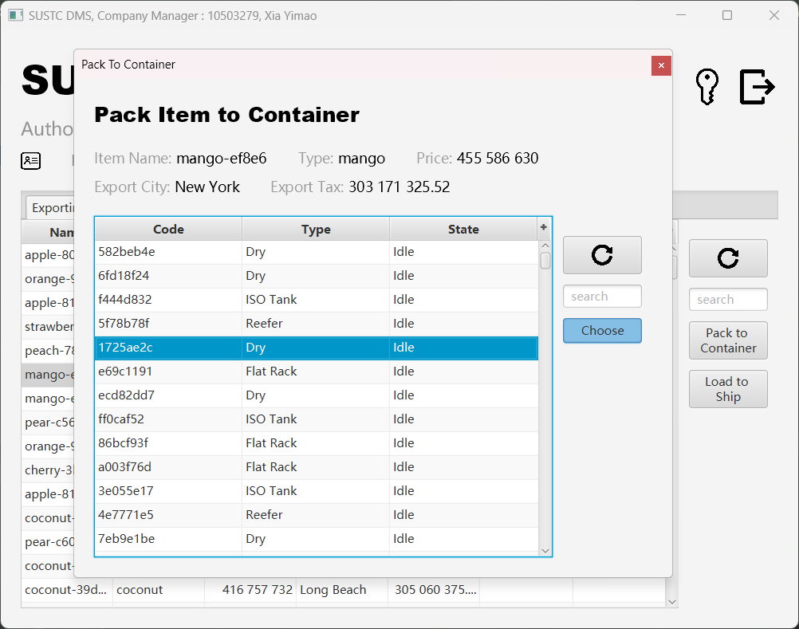
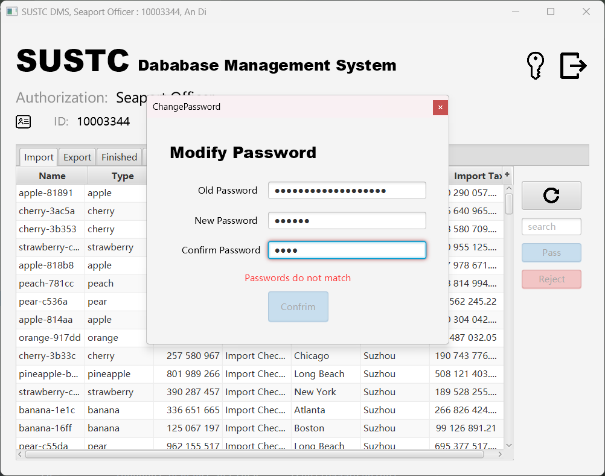
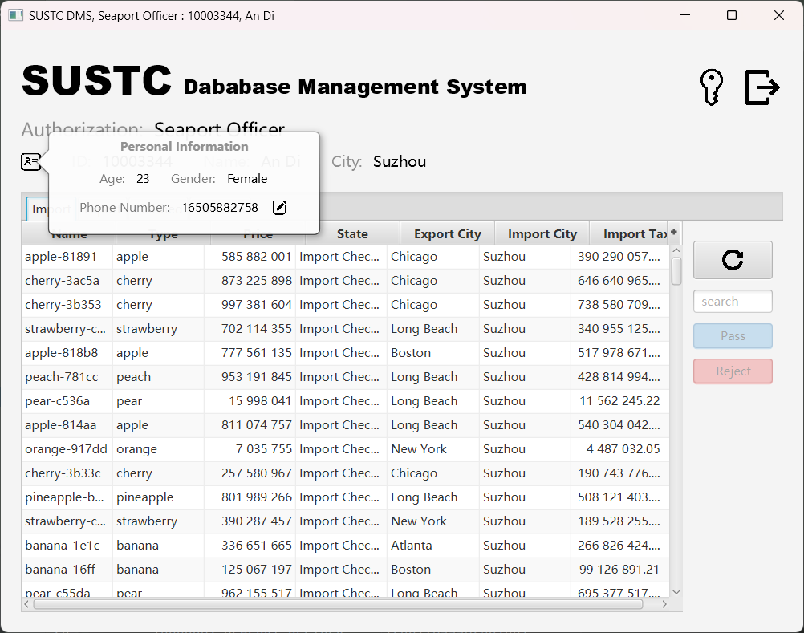

# CS307 project 2
Project report: https://docs.qq.com/doc/DU1JEQUl6V2lqRmRP

Project github: https://github.com/LittleEtx/CS307_Project_2

The project is built by maven. Source codes are in `src/main/java`

The main class required to run tests is `main.DatabaseManipulation`.
During the process of initializing, databases and users will be automatically created. The detailed scripts are in
the `scripts` dictionary.

The main class to run server is `com.littleetx.cs307_project_2.server.Server`

The main class to run GUI client is `com.littleetx.cs307_project_2.client.SUSTC_ClientApplication`

## Introduction

This is the second project of CS307 Database System. The project is to build a database system for a delivery company
SUSTC.
More information can be found in the file `CS307-2022Fall-Project2.pdf`.

The whole project can be seperated into three parts: database system (using postgresql), server that accesses to the
database
and client (using javafx) for logging in and manipulate data.

We spend a lot of time on the client design, here are the screenshots.
For more functionality, please refer to the report link above.

